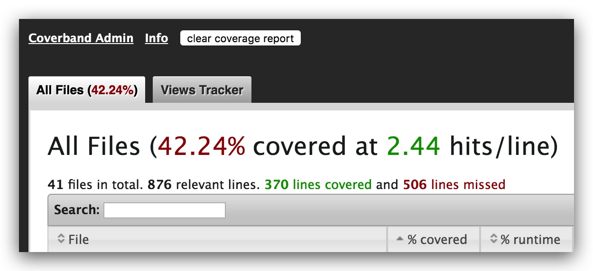

# Integrating Coverband Production Coverage Analysis

The method described here makes it as easy as possible to add Coverband coverage tracking. A few simple changes and additions, and the whole mechanism can be enabled and disabled by commenting out one line in the Gemfile and then pushing code to the instance.



_Note that Coverband's "Views Tracker" will only record which views were rendered, not a line-by-line breakdown._

## Files Changed

### Gemfile

Add the following:

```ruby
group :production, :staging, :development do
  gem 'coverband', require: false
  gem 'redis' # If not installed elsewhere
end
```

Note the `require:false`. This is handled in `application.rb` so as not to mess up rake tasks because it can't connect to Redis. If you're using a cloud-based Redis, then you can skip the `require:false` and the change to application.rb mentioned below. I think it's safer overall to do it this way because then you're running the same way on your desktop development as you are out on a server.

### application.rb

Add the following after `Bundler.require(*Rails.groups)`. This will prevent Coverband from running during Rake tasks during deployments. Rake tasks may crash if Coverband can't connect to Redis, so this will work around the issue.

```ruby
require 'coverband' if ( !($0 =~ /rake$/) && Gem.loaded_specs.has_key?('coverband') )
```

### config/routes.rb

Add the following near the end of the file.

```ruby
  if defined?(Coverband::Reporters) == 'constant'
    authenticate :user, lambda { |u| u.admin_access? } do
      mount Coverband::Reporters::Web.new, at: '/coverage'
    end
  end
 ```
 
Note that this assumes a specific authentication in this example. If you're using ActiveAdmin, for instance, you'll authenticate off of Warden. Something kind of like:

```ruby
if defined?(Coverband::Reporters) == 'constant'
  admin_web_constraint = lambda do |request|
    current_user = request.env['warden'].user
    current_user.present?
  end

  constraints admin_web_constraint do
     mount Coverband::Reporters::Web.new, at: '/coverage'
  end
end
```

### config/coverband.rb

Copy the `coverband.rb` file from this repository into `config/initializers` and make any changes you feel are needed. Probably the only change would be the Redis URL.

## Using Coverband

**VERY IMPORTANT: You MUST have a shared Redis server that all your instances use. This will be what gets filled in to the initializer either by hard-coding or setting an ENV variable. For single-server Staging instances or development, you can get by with a local Redis server. But for Production you will need Redis in the cloud that every instance can access.**

With the changes described here folded in, Coverband will fire up automatically the next time it is deployed (or the next time you do a `bundle` and start up your system in `:development`). That's all there is to it. 

The report viewer will be mounted at `/coverage`.

## Turning Coverband Off

Simply comment out the line in your Gemfile:

```ruby
  # gem 'coverband'
```

... and run Bundler and deploy. That's it. This means you can run coverage again at a later date (maybe after a few gazillion code changes) without much hassle.

## Command Line

You can control Coverband from the command line as long as you're local configuration is talking to the same Redis server.

```bash
rake coverband:clear     # clear saved coverage data
rake coverband:coverage  # generate static html file report
```


